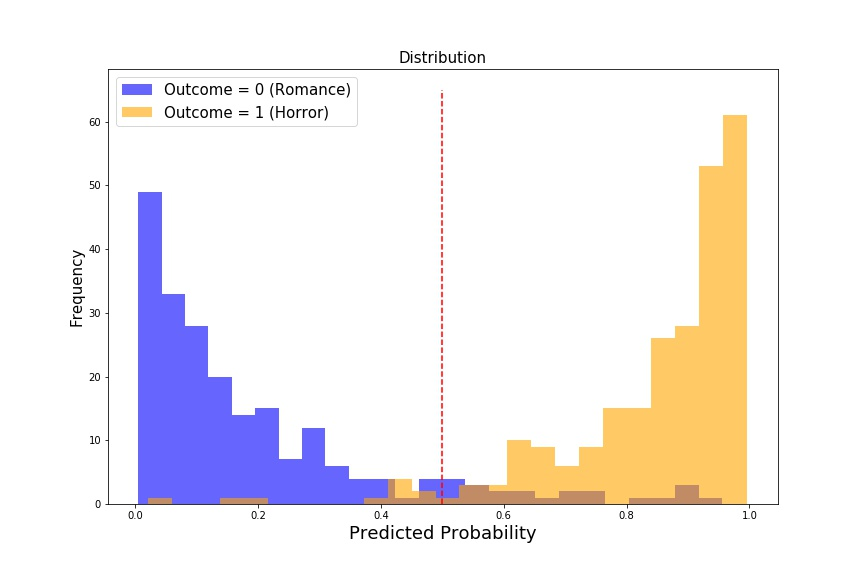
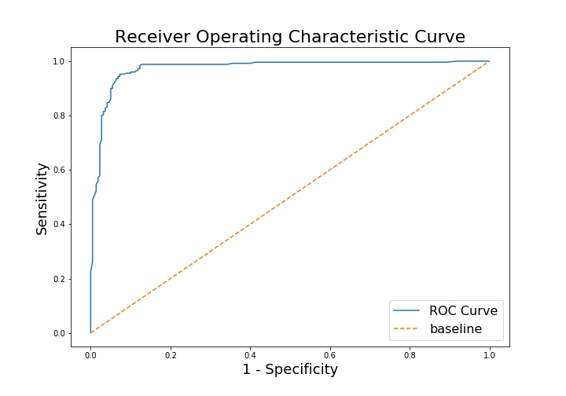

#  Project 3 - Web API & Reddit Classification

## Contents:
- [Overview and Problem Statement](#Overview-and-Problem-Statement)
  1. [Overview](#Overview)
  2. [Problem Statement](#Problem-Statement)
- [Summary of Dataset](#Summary-of-Dataset)
  1. [Source of Datasets](#Source-of-Datasets)
  2. [Brief description of datasets](#Brief-description-of-datasets)
  3. [Brief data dictionary of final dataframe used for modelling](#Brief-data-dictionary-of-final-dataframe-used-for-modelling)
- [Data Cleaning and EDA Process](#Data-Cleaning-and-EDA-Process)
- [EDA and Feature Selection Process](#EDA-and-Feature-Selection-Process)
- [Model Evaluation of Multinomial NB Classifier](#Model-Evaluation-of-Multinomial-NB-Classifier)
- [Possible Inferences of Multinomial NB Classifer Model)](#Possible-Inferences-of-Multinomial-NB-Classifer-Model)
- [Executive Summary and Conclusion](#Executive-Summary-and-Conclusion)

---
## Overview and Problem Statement

### <u>Overview</u>

For our third project, we are tasked with implementing a proof-of-concept classification model to help correctly identify a submitted text within a subreddit thread.

The scope of this project will be limited to 2 subreddits:
1. <b>Romance</b> - <i>romance advice/questions</i>
2. <b>Superscaryshortstories</b> - <i>horror short stories</i>

Based on the classification results, we can sieve through submitted texts to see if they are of the correct topic before being approved on the subreddit thread. This will help prevent the wrong contents from being in the wrong subreddit and causing unnecessary unease of the subreddit followers _(e.g. horror posts being posted on the romance section might cause the romance subreddit readers to feel unease.)_

---
### <u>Problem Statement</u>

**1.** Based on the 2 datasets extracted from Reddit, are we able to build a classification model which is able to accurately classify the text submitted.

**2.** What are the features/words that has the most impact on the text being classified as a category

**3.** Using our model as a proof-of-concept, how do we proceed from here to implement a model to classify between the correct subreddit topic vs everything else.

---
## Summary of Dataset

### <u>Source of Datasets</u>:

Our datasets are scrapped from the Reddit api with the following url:

1. Superscaryshortstories - _'https://www.reddit.com/r/shortscarystories.json'_
2. Romance - _'https://www.reddit.com/r/romance.json'_

### <u>Brief description of datasets</u>:

Both datasets were scrapped for approximately 1000 data entries each. We then delved deeper to extract the text data of each subreddit and combined them into an overall dataframe for further analysis and modelling.

### <u>Brief data dictionary of final dataframe used for modelling</u>:

| Feature   | Type                 | Description                                                                 |
|:----------|:---------------------|:----------------------------------------------------------------------------|
| selftext  | Object (String)      | <b>Input Features</b> - The string of text submmitted by                    |
| subreddit | Categorical (String) | <b>Target</b> - 'shortscarystories' (horror) / 'romance'                    |

---
## Data Cleaning and EDA Process

**1. Train Test Split**

**2. Exploratory Data Analysis**

<b><u> Stopwords </u></b>

Our exploratory analysis is an iterative process and throughout the iterations, one of the parameters we kept revisiting is issue of stopwords.

In one of the iterations of the exploratory process, the words 'don', 'like', 'just' & 'time' appears in both sets of texts a significant number of times and we included them in the stopwords to drop them as we felt that these words would be of no value to either targets.

Also, when running the models, we updated the stopwords with the words which were brought to our attention by the warnings of the models.

<b><u> Top 3 words of each category </u></b>

Using a basic CountVectorizer, we did a transformation of the documents of the corpus and extracted the word counts for both categories of the subreddit.

The top 3 word counts for Horror themed texts are:

| Rank  | Word     | Count        |
|:------|:---------|:-------------|
| 1     | eyes     | 525          |
| 2     | know     | 463          |
| 3     | door     | 458          |

While the top 3 word counts for Romance themed texts are:

| Rank  | Word     | Count        |
|:------|:---------|:-------------|
| 1     | know     | 493          |
| 2     | love     | 468          |
| 3     | really   | 405          |

<b><u> Visualizing the word counts using a WordCloud </u></b>

<b> Horror </b>

<b> Romance </b>

---
## EDA and Feature Selection Process

**1. Establishing Baseline Accuracy**

  Baseline accuracy: <b><u>53.26%</u></b>

**2. Mapping of targets into binary format**

**3. Creating Stemming & Lemmatizing Functions for RandomizedSearch**

  _Created custom Lemmatizing & Stemming functions using NLTK package to aid in RandomizedSearch later on_

**4. Implementing Pipeline & RandomizedSearch**

  Created pipeline and conducted randomized search for optimized hyperparameters for the following:

  1. TfidfVectorizer & Naive Bayes (Multinomial) Classifier  
  2. TfidfVectorizer & RandomForest Classifier

<b><i><u>Rationale:</u></i></b>

<b>TfidfVectorizer</b> - <i>Tfidf gives us a normalized representation which I felt would be a more comprehensive representation of the words instead of just the count matrix.</i>

<b>RandomizedSearch</b> - <i>Tried GridSearch and the training time significantly increased with seemingly very insignificant improvements in results. To save on time and computational costs, I have decided to use RandomizedSearch instead of GridSearch.</i>

---
## Model Evaluation of Multinomial NB Classifier

In total we tried 2 models: the <i><b> Multinomial Naive Bayes Classifier</b></i> & the <i><b>RandomForest Classifier</b></i>.

Based on the randomized search of both models, it seems like the Multinomial Naive Bayes performs better at an accuracy of 93% to 94% and the RandomForest model yields a slightly lower accuracy of 92% to 93%. Both models perform significantly better than our baseline accuracy.

Based on our iterations, we shall select the <i><b> Multinomial Naive Bayes Classifier</b></i> as our final model for this proof-of-concept project.

**Evaluation of Multinomial NB Classifier**

<b> Accuracy: </b> <i>93.2%</i>

<b> Sensitivity: </b> <i>91.2%</i>

<b> Specificity: </b> <i>90.9%</i>

<b> Outcome Predicted Probability Distribution: </b>

<b> AUC-ROC Curve: </b>

<b> Comments: </b>

1. Based on the objective of our project the best metric in this instance would be <b>Sensitivity</b>. Erring to the safer side and reducing the <i>False Negatives</i> will help us capture more horror entries which are not supposed to be in the Romance subreddit section. This will help us further prevent readers in the Romance subreddit from reading texts which might make them feel uncomfortable.

2. From our AUC-ROC Curve & the Predicted Probability Distribution, we can conclude that the features leading to the classification of these 2 categories do not overlap by much. This is also evident in the concurrently high sensitivity & specificity.

---
## Possible Inferences of Multinomial NB Classifer Model

We shall attempt to look at the Multinomial Naive Bayes model for any basic inferences.

Sorting & extracting the top 10 words which have the highest impact in our classification of a text as Horror are:

| Rank  | Word     | Log Probability  |
|:------|:---------|:-----------------|
| 1     | eye      | -6.099409        |
| 2     | door     | -6.150998        |
| 3     | man      | -6.313227        |
| 4     | night    | -6.337655        |
| 5     | know     | -6.399682        |
| 6     | room     | -6.408069        |
| 7     | day      | -6.416506        |
| 8     | thing    | -6.463643        |
| 9     | didn     | -6.498178        |
| 10    | people   | -6.502723        |

<i>The higher the Log Probability of the feature(word), the higher the influence it has on the classification of our text as horror.</i>

From the list of top 10 words, it certainly does seem like those are words which someone would be unlikely to use when writing a text requesting romance advice. However, it also seem to me that the words can be considered generic when it comes to texts on topics other than romance and horror. As such, we will be discussing the impact of this in the conclusion segment.

---
## Executive Summary and Conclusion

As mentioned in the <i><b>Possible Inferences</b></i> segment: <i>even though the words are seemingly distinct from each category, they can still be considered generic when it comes to texts on other topics</i>

Bearing in mind that this project is a proof-of-concept and we are supposed to be proceeding from here to implement a model to classify between the correct subreddit topic vs everything else. The potential impact of our study for this 2 topics is:

<b>Our model being build on seemingly generic words</b>

This "phenomenon", I believe is a clear indication of the limitation of our model.

Assuming we move on from here to start classifying a <b>singular topic</b> vs <b>everything else</b> (_instead of the current topic vs topic_), I believe there would be a drastic drop in our model performance simply due to the fact that with <b>"everything else"</b> comes a larger mix of generic words. We would then have a lot of overlapping features/words leading to a significantly harder job for our model.

<b><u>Plausible Solution:</u></b>

_So far our preprocessing was done using TFIDF which is a normalized version of the CountVectorizer. This method is computationally cheap and easy to build, but its limitation will only allow us to go so far. I believe in order to move on to the next stage of classifying <b>singular topic</b> vs <b>everything else</b> problems, we would need to use more advanced preprocessing techniques like Word Vectorizers (BOW & Skip Grams) and run our models on the aggregated vectors of each text. By such, we move beyond the simple counting of words to capture relative meaning behind groups of words, helping us ease the problem of overlapping features/words._

_This solution would be computationally much more expensive due to the use of Deep Learning models to handle the preprocessing._
